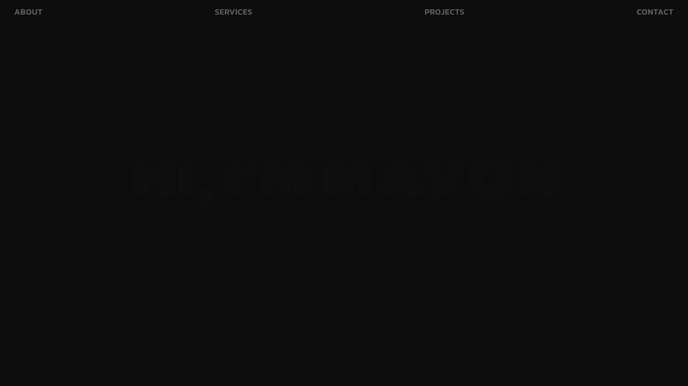
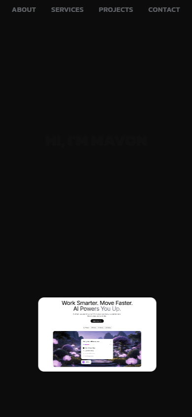

# Mavon Website 2.0

A premium, modern web application built with **React**, **TypeScript**, **Vite**, and **Tailwind CSS**, featuring dynamic micro-animations, glassmorphism aesthetics, and responsive design.

## 📸 Hero Section Preview

### Desktop View


### Mobile View


## ✨ Features

- **Modern & Dynamic UI**: Smooth animations using Framer Motion and custom CSS micro-interactions.
- **Premium Hero Section**: High-impact typography with looping background animations and clean edge gradients.
- **Responsive Layouts**: Fully optimized for mobile, tablet, and desktop viewing experiences.
- **Fast Performance**: Built on top of Vite and TypeScript with strict type checking and linting.

## 🚀 Getting Started

### 1. Install Dependencies
```bash
npm install
```

### 2. Run Development Server
```bash
npm run dev
```

### 3. Build for Production
```bash
npm run build
```

### 4. Preview Production Build
```bash
npm run preview
```

